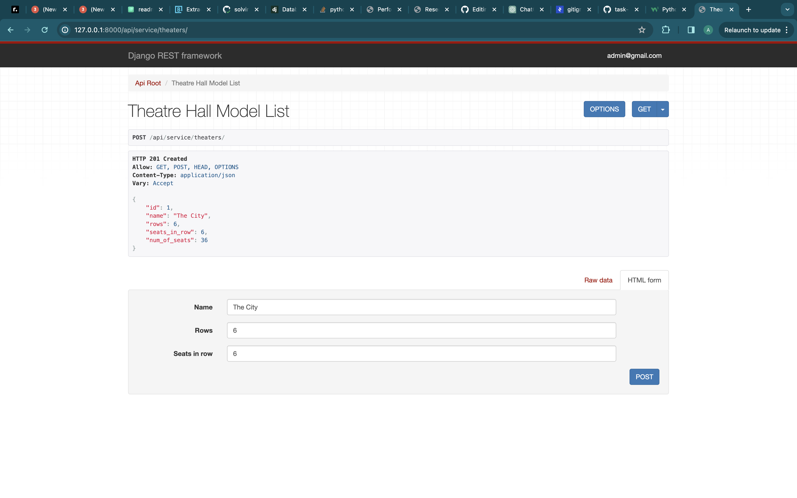

# Theatre Service API

API service for the theatre management written on DRF

DB Structure:


1. All urls:


2. Actor detail:


3. Genre detail:


4. Play detail:


5. Play list:


6. Theatre detail:


7. Performance detail:


8. Performance list:


9. Reservation detail:


10. Reservation list:


## Installation using GitHub

Install PostgreSQL and create db

```bash
git clone https://github.com/Oleksiy-Lyashenko/theatre_api_service
cd theatre_api_service
python -m venv venv
source venv/bin/activate
pip install -r requirements.txt
set DB_HOST=<your db hostname>
set DB_NAME=<your db name>
set DB_USER=<your db username>
set DB_PASSWORD=<your db user password>
set SECRET_KEY=<your secret key>
python manage.py migrate
python manage.py runserver
```


    
## Run with Docker

Install Docker

```bash
docker-compose build
docker-compose up
```


## Getting access using API on PC

- create user via /api/user/register/(only for read data)
- create admin user(for add and change information)
```bash
python manage.py createsuperuser
```
- get access token via /api/user/token/


## Getting access using API with Docker

- create container
- create admin user in container
```bash
docker exec -it <container_name> bash
python manage.py createsuperuser
```
- get access token via /api/user/token/
